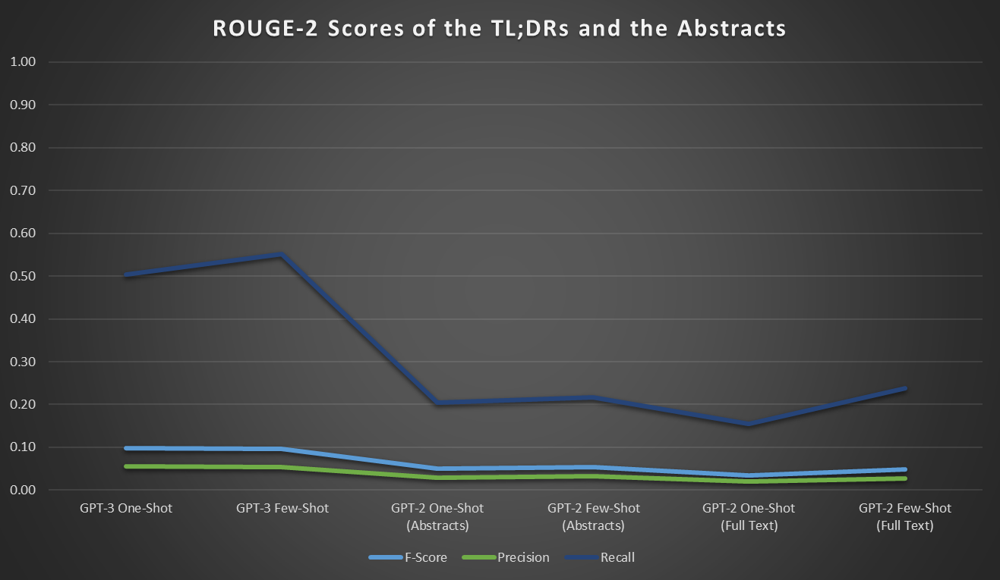
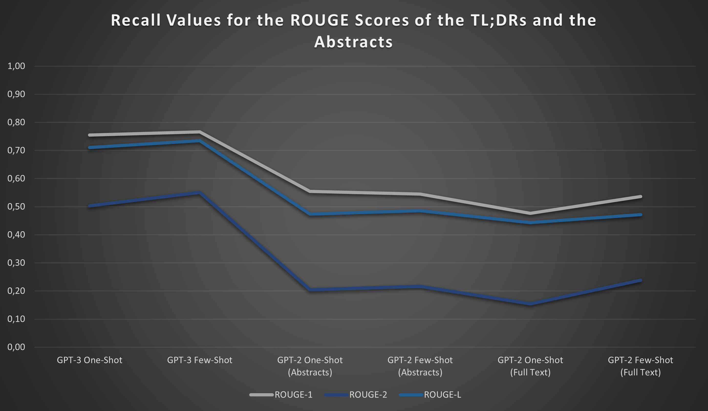

# Comparing GPT-3 With Fine-Tuned GPT-2 Models Trained on Abstracts and Full Papers from the EconStor Database

Authors:  
Atul Kumar Yadav, Jonas Peltner, Nicolas Steen, Philipp Seeler, Stefan Pohle, Steffen Brandt

## Summary
The overall goal of the two projects documented in this repository are the comparison of different fine-tuned GPT-2 models and the GPT-3 model without fine-tuning. The results might thereby give a hint to what extent fine-tuning is still a very worthwhile thing to do, or it might be more to focus on the integration of larger models and the design of the prompts for these models.  
This question will be even more pressing when estimated models comparable to GPT-3 or even better get fully open source, which is very probable looking at initiatives such as [EleutherAI](https://www.eleuther.ai/).

We compared the abilities of the different approaches via the following two projects.

### Abstract-Based Generation of TL;DRs
In this project, we provided the GPT models with the abstract of a fulltext paper and asked it to generate a Too-Long;Didn't-Read (TL;DR) summary of it, that is a one sentence summary of the corresponding full text paper.
#### Data
We used 148 open source papers with a focus on climate change from the EconStor database for fine-tuning the GPT-2 (including those used for validation) and five abstracts from papers on climate change that were not included in this database and served as test data.
#### Method
We compared three different models:
- a GPT-2 (small model with 117M parameters) fine-tuned only with the abatracts of the papers
- a GPT-2 (small model with 117M parameters) fine-tuned with the full texts of the papers (with title page and bibliography excluded)
- an untrained GPT-3 (ada model by openAI)
  
Further, we compared two different prompt approaches for each model:  
- a one-ohot approach, with only one example abstract and TL;DR provided
- a few-shot approach, with two example abstracts and TL;DRs provided
For each model and each approach five TL;DRs were generated. The generated TL;DRs were than compared using the [ROUGE score](https://en.wikipedia.org/wiki/ROUGE_(metric)) and four independent human ratings. The categories for the human ratings were defined to vary from 0 ("really bad") to 3 ("quite ok or better").

#### Results
Figure 1, Figure 2, and Figure 3 provide a summary of the results on the ROUGE scores and on the quality according to the human ratings.
(I would propose to include the tables as screenshots from Excel and refer to the Excel in the GitHub for details.)
  
The human ratings show that:
(1) Few shot (here 2-shot) learning already works notably better then on-shot learning,
(2) For the given case fine-tuning on abstracts yields better results then our fine-tuning on the full texts, and
(3) GPT-3 yield notably better results without fine-tuning than the two fine-tuning approaches we used for GPT-2.

Figure 1: Results of the Human Ratings
  
The results in Figure 2 show that the recall score is the best score in order to differentiate the models' results. The results for the ROUNGE-2 score are also very much in accordance with the human ratings.

Figure 2: Results of the ROUGE-2 Scores
  
The results in Figure 3 additionally show that when comparing the ROUGE-1 score, the ROUGE-2 score, and the ROUGE-L score, all ROUGE scores yield similar results but the ROUGE-2 score seems to make differences between the models most transparent.
  

Figure 3: Results of the Recall for Different ROUGE Scores
  
Notes:  
**ROUGE-n**: Overlap of n-grams between the abstracts and the summaries  
**ROUGE-L**: Longest Common Subsequences. Takes sentence level structure similarity naturally into account and identifies longest co-occurring in sequence n-grams automatically  
**Precision**: Proportion of the n-grams in the generated summary that are also present in the abstract (i.e. a rouge-1 precision of 0.21 means that 21% percent of unigrams in the generated summary are also present in the abstract).  
**Recall**: Proportion of the n-grams in the abstract that are also present in the summary (i.e. a rouge-1 recall of 0.45 means that 45% of the unigrams in the abstract are also present in the summary).  
**F-Score**: Measure of robustness and precision. Harmonic mean of your precision and recall. Greatest when precision and recall are equal.  

#### Final Remarks
When fine-tuning the GPT-2 we noticed the importance of the text preprocessing for the full papers. Since the texts of the papers were based on scanned PDFs, they included a lot of "unclean" texts, like page breaks, references, and tables. We tried to remove big part by automatic text preprocessing and by manually removing it but we, for example, did not remove tables. A better approach for the future might be to only include the introduction and conclusion of each paper - also considering the purpose of the task.

### Answering of (Climate Cange) Economic Specific Questions
In this project we wanted to explore whether GPT-2 could be used to answer domain-specific questions after having been trained on scientific papers.

#### Data
We used 148 open source papers with a focus on climate change from the EconStor database for fine-tuning the GPT-2 (including those used for validation).

#### Method
We tried fine-tuning GPT-2 models on scientific papers and abstracts and then used few-shot prompts to ask the trained models specific questions relevant to the area of expertise covered by the papers.

We used two main approaches here, one using gpt-2-simple, as documented in [this notebook](./03_question-answering/gpt-2-simple.ipynb) and another using aitextgen, documented in [this notebook](./03_question-answering/aitextgen.ipynb).

For preprocessing we tried three different methods of merging the full-text papers. For the first one we simply joined all the text files into a single one. For the next one we attempted to remove new lines within paragraphs, as those appeared often as an artefact of the previous pdf format. For the last method we also removed short lines (>50 chars) that didn't appear to be part of any paragraph but instead headlines, tables or sources, all of which would have only polluted the dataset.

The different preprocessing scripts are documented in [merge_full_texts_3_approaches](./03_question-answering/merge_full_texts_3_approaches.py).

#### Results
Our results were of mixed quality, with perhaps 10% being somewhat usable. As we weren't working in the domain of any known (to us) scoring system,
we could only evaluate them manually.

Following are some example results from the aitextgen approach:

**Q:** How much does nuclear power affect world climate change?

**A:** Nuclear power is generally considered as a cleaner energy option, but there are limits to its use for power generation and consumption. Heat is a basic element of any system’s operation. Heat is also generally expected to be an inert greenhouse gas.
Specific CO2 emissions are important for determining whether there is a change in temperature. For example, if greenhouse gas is 1.0% of the total energy mix, and temperature changes are not important (for example, if the temperature of a city is set at room temperature), it is not important

**Q:** What are some problems with using renewable energy?

**A:** Numerous problems with using renewable energy. First, the problems with using renewable energy are not new. For example, in the early '90s, the energy density of the sun was about 1,500 times more than the Earth’s surface. Today, the problem is much more severe. In fact, the Earth’s surface temperature is currently reaching 1,450 times more than the surface temperature of the sun in the next 100 years. According to the Intergovernmental Panel on Climate Change (IPCC), the sun’s energy density

**Q:** How much does coal power affect world climate change?

**A:** According to the World Coal Organization, total US$238 billion is burned by coal-based power plants. At current prices, coal-based power plants add approximately 20% of the total US electricity consumption. According to the International Energy Agency (IEA), coal-based power plants add approximately 20% of total US electricity consumption. In fact, according to the IEA, coal-based power plants are the largest-dichotically-generated source of greenhouse gas in the world, accounting for almost 90% of the total US electricity consumption.

Here are also some examples generated with the GPT-2-Simple approach:

**Q:** What will be the economic effects of climate Change? 

**A:** It is not yet clear what the economic effects of climate change will be. However, likely the main result will be disruption to the existing global financial markets. Ecological disasters, droughts, drought, floods, etc. have already started, and will continue to have a major impact on economies worldwide. It is also expected that the effects will be felt most heavily on the poorest and least developed countries.

**Q:** How much does nuclear power affect world climate change? 

**A:** Nuclear power releases a lot of greenhouse gases into the atmosphere, as most of the electricity we use comes from fossil-fuel-generated energy industry. Nuclear energy also releases large amounts of heat-trapping gas into the atmosphere, such as methane and carbon dioxide (CO2)

**Q:** How much does global warming affect wildlife tourism? 

**A:** Climate change and tourism are two very different things, but climate change is more than just bad for tourism. Climate change can cause significant declines in the abundance of natural habitats, disrupt migration patterns of some species, lead to new epidemics (the West Nile virus, Ebola and yellow fever). Tourism, on the other hand, can be very good for a lot of species of migratory birds, butterflies, moths, and other species.

The full results for different setups can be found in the respective model subfolders in [03_question-answering](./03_question-answering).

## Details

### Dataset
[EconStor](https://www.econstor.eu/) is a repository of open access
economics papers. The dataset we worked with contained both
metadata for all papers in JSON as well as the full contents as txt files.

Unfortunately the full texts appear to have been scraped directly
from PDF files and still contain bibliographies, formatting like page numbers and headings as well as tables and figure descriptions, meaning additional cleanup was required before they could be used.

For our work we have decided to use a subset of papers related to the topic of climate change.

### Dataset preparation
The notebook [00_import_econstor_data.ipynb](./00_import_econstor_data.ipynb) handles downloading the dataset and saving it to Google drive.

[02_prepare_fulltext.ipynb](./02_prepare_fulltext.ipynb) handles initial pre-processing of full text papers. Further processing was required to handle journal-specific formatting.
The results from this are stored in `02_fulltexts_climate-change`, which contains 276 papers in total.

### Approaches for Fine-Tuning GPT-2
We looked into different approaches for fine-tuning GPT-2 on Google Colab and ended up working with two different libraries,
both by the talented Max Woolf.

#### [gpt-2-simple](https://github.com/minimaxir/gpt-2-simple)
gpt-2-simple was published in mid 2019, is based on the original Tensorflow (<2.0) implementation of GPT-2 and comes with 
a Colab notebook.

It is limited to generating a maximum of 1024 tokens per request and struggles with GPU memory limits when using larger models
and large input datasets. There is however [a fork](https://github.com/drfinkus/gpt-2-simple) that should not have
the latter problem.

#### [aitextgen](https://github.com/minimaxir/aitextgen)
aitextgen was started in early 2020 and is designed to be a successor to gpt-2-simple. It is built using
a PyTorch implementation of GPT-2 from Hugging Face Transformers. This means that it should be able to make use of
upstream improvements in the future.

aitextgen does train well on the 124M model, can import trained gpt-2-simple models, and splits tokenization
from model training, allowing users to tokenize datasets ahead of time, even on a different machine.

However as of early 2021, this library still suffers from some a couple [known issues](https://github.com/minimaxir/aitextgen#known-issues).
Namely finetuning larger models is broken (and using FP16 failed for us as well), and we had to pin some dependencies to older versions
as recent updates had broken the notebook ([issue](https://github.com/minimaxir/aitextgen/issues/78)).

#### [Hugging Face Transformer Library](https://huggingface.co/transformers/)
The Huggingface Transformers library provides general-purpose architectures for Natural Language Understanding (NLU) and Natural Language Generation (NLG) with over 32+ pretrained models in 100+ languages and deep interoperability between TensorFlow 2.0 and PyTorch.
The fine-tuning based on this approach is, for eexample, described [here](https://towardsdatascience.com/fine-tuning-gpt2-for-text-generation-using-pytorch-2ee61a4f1ba7), which was adapted for our purposes to fine-tune the model for the TL;DR generation; see [this notebook](https://github.com/steffen74/GPT-2/blob/main/03_tldr/01_GPT-2_with_abstracts.ipynb) for the fine-tuning based non journal abstracts and [this notebook](https://github.com/steffen74/GPT-2/blob/main/03_tldr/01_GPT-2_with_full_texts.ipynb) for the fine-tuning of the full text journals.

### The GPT-3 API
GPT-3 is the third-generation language prediction model in the GPT-n series (and the successor to GPT-2) created by OpenAI and is based on the same structure for the architecture just in a much bigger form and trained with much more data.
In contrast to GPT-2 the model weights are not published and there is currently no camparable (trained) model publicly available. In order to use the model, you have to have access to the [OpenAI GPT-3](https://openai.com/blog/openai-api/) API. For our projects we used the access of opencampus.sh to generate the short answers for the climate change economics related questions and to generate the TL;DRsfor the abstractsfrom the journals related to climate change economics.

The script [04a_GPT_3_QA.ipynb](./04a_GPT_3_QA.ipynb) is used to generate short answers for the climate change economics related questions and the script [04b_GPT_3_TLDR.ipynb](./04_GPT_3_TLDR.ipynb) is used to generate the TL;DR for the abstract from the journals related to climate change economics. 
